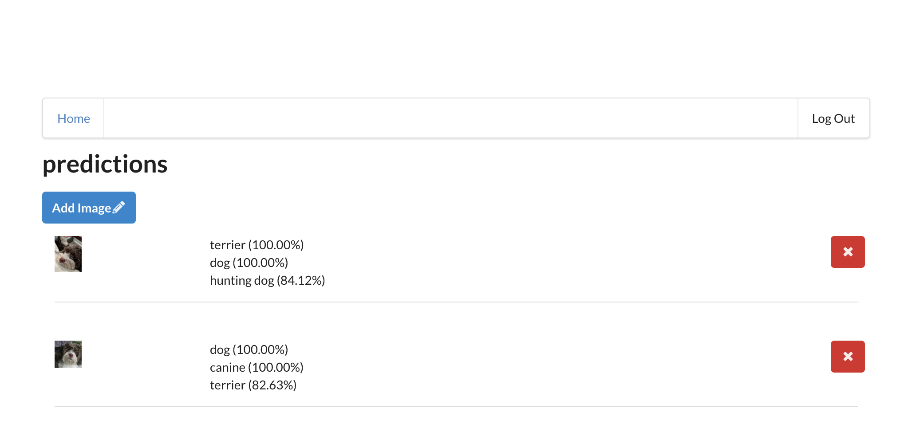

# Udacity Capstone Project: Image predictions

## Overview

A picture is worth a thousand words:


This is my final submission for the Udacity Nano-Degree Cloud Developer. This application is a simple cloud application that stores images that are tagged by an external API. It has the following features:
- The application allows users to upload photos of things
- After the successful upload of an image an API for image-tagging is called and the resulting prediction is automatically added to the image entry
- The user can delete the entries
- The user must be logged in to get full functionallity
- Each user sees only their own uploaded images and predictions

## Requirements

- Inside the project there are two sub-projects:
    - backend
    - client
- Backend is deployed via the serverless framework. You can clone the repository and deploy the backen with:
    ```
    serverless deploy --aws-profile <your-profile>
    ```
- Currently the backend is also hosted for the project submission:
    - GET - https://shkkibkcq3.execute-api.us-west-1.amazonaws.com/dev/images
    - DELETE - https://shkkibkcq3.execute-api.us-west-1.amazonaws.com/dev/images/{imageId}
    - POST - https://shkkibkcq3.execute-api.us-west-1.amazonaws.com/dev/images
- The frontend is created from previous lessions of the course
- The client can be run locally (Node.js 14.x) via:
    ```
    npm install
    npm run start
    ```
